# 基于微信公众号的校园商铺系统（SpringBoot）

### *项目简介*
本项目以Spring Boot和微信特性为核心技术栈，实现一个从下单到接单流程完整，包含买家端和卖家端前后台功能的校园商铺平台。前端是一个使用Vue.js构建的运行于微信公众号的WebApp，前后端完全分离，前后端之间通过RESTful风格的接口相连。

### *项目架构*
1. 前端:
   - Vue.js
   - WebApp
2. 后端:
   - SpringBoot
   - Bootstrap + Freemarker + Thymeleaf + JQuery
3. 前后端连接:
   - RESTful
4. 数据库:
   - SpringBoot + JPA
   - SpringBoot + MyBatis
5. 缓存:
   - SpringBoot + Redis
      - Redis: 分布式 Session 和 分布式锁
      - 解决`超卖问题`
6. 消息推送:
   - Spring Boot + WebSocket
7. 微信端:
   - 微信扫码登录
   - 消息模板推送
   - 微信支付和退款

### *项目设计*

#### [API文档](./docs/API.md)

#### [微信特性](./docs/WeChat.md)

1. 微信授权
2. 微信支付
3. 微信退款

#### 角色划分

1. 买家端（微信端）
2. 卖家端（PC端）

#### 功能模块划分

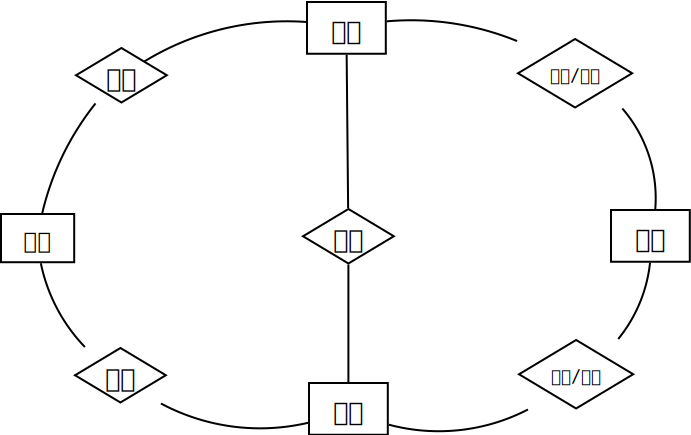

#### 部署架构

微信前端和浏览器请求通过Nginx转发给Tomcat，如果需要缓存，就请求Redis，否则就请求MySQL

#### 分布式系统

[分布式系统](./docs/分布式系统.md)

#### MyBatis

[MyBatis](./docs/MyBatis.md)

#### Redis

[Redis](./docs/Redis.md)

#### 数据库设计

1. 表之间的关系

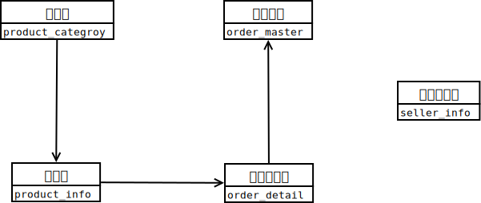

2. 具体表

| #          | Table            |
| :--------- | :--------------- |
| 商品分类表 | product_category |
| 商品详情表 | product_info     |
| 订单主表   | order_master     |
| 订单详情表 | order_detail     |
| 卖家信息表 | seller_info      |

### *开发环境搭建*  

| #          | Version        | #     | Version    |
| :--------- | :------------- | :---- | :--------- |
| SpringBoot | 2.3.12.RELEASE | Linux | CentOS 7.3 |
| Idea       | 2022.2         | JDK   | 1.8.0_361  |
| Maven      | 3.9.4          | MySQL | 5.7.25     |
| Nginx      | 1.18.0         | Redis | 6.2.13     |

### *日志*

[日志框架](./docs/logger.md)

### *功能实现*

1. 买家端
    - [x] 查询商品类目
    - [x] 查询上架商品
    - [x] 创建订单
    - [x] 查看订单
    - [x] 取消订单

2. 卖家端
    - [x] 查看、完结和取消订单
    - [x] 查看、更新和上下架商品
    - [x] 卖家端新增商品和类目

3. 微信端
    - [x] 微信授权
    - [x] 微信登录
    - [x] 微信支付
    - [x] 微信退款

4. 买家和卖家端联通
    - [x] 分布式session
    - [x] 卖家信息表
    - [x] 登陆登出

5. 优化
    - [x] 异常捕获
    - [x] MyBatis
    - [x] 并发(Redis分布式锁)
    - [x] Redis(缓存层)

### *项目演示*

- 部分演示：

  - 买家端-查询商品类目

  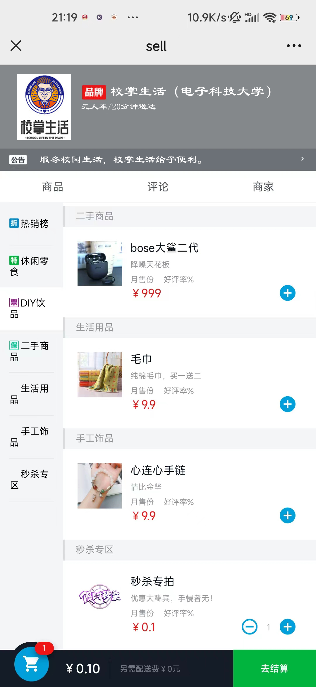

  - 买家端-创建订单

  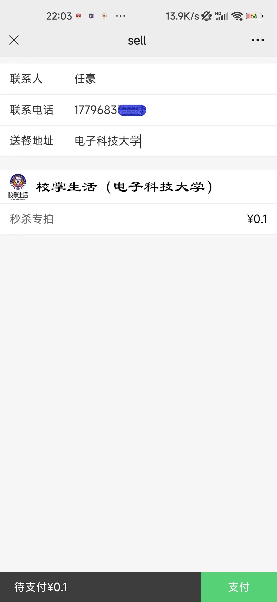
  
  - 卖家管理系统-订单列表

  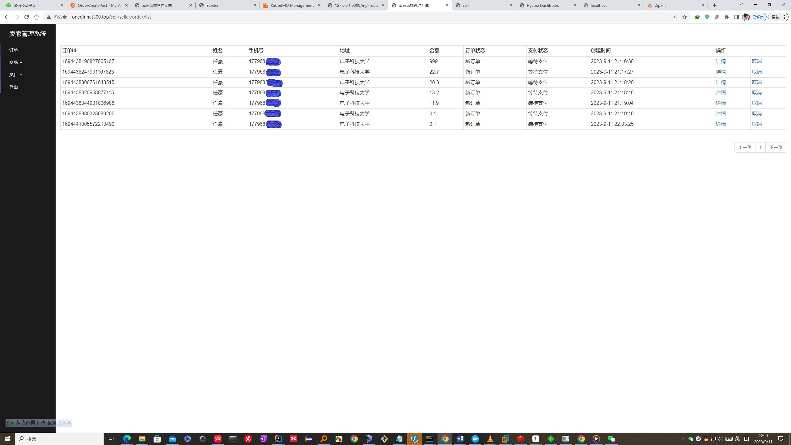
  
  - 卖家管理系统-完结订单
  
  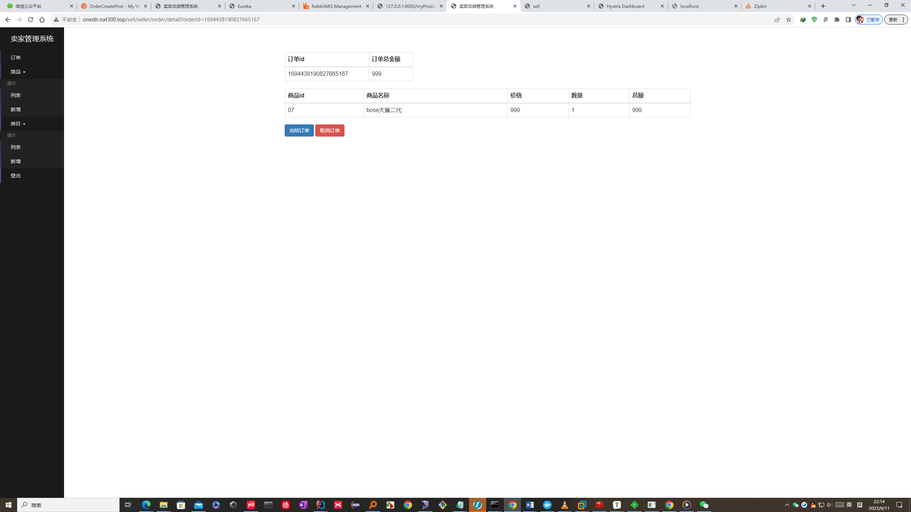
  
  - 卖家管理系统-商品列表
  
  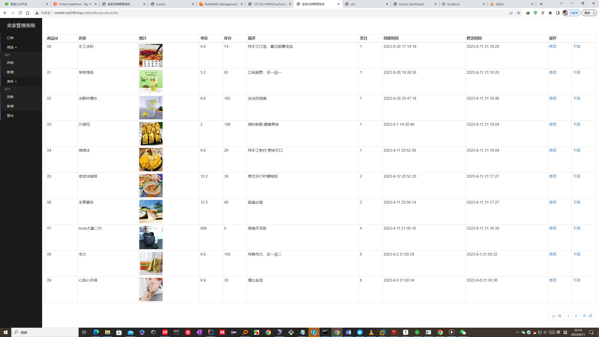
  
  - 卖家管理系统-添加商品
  
  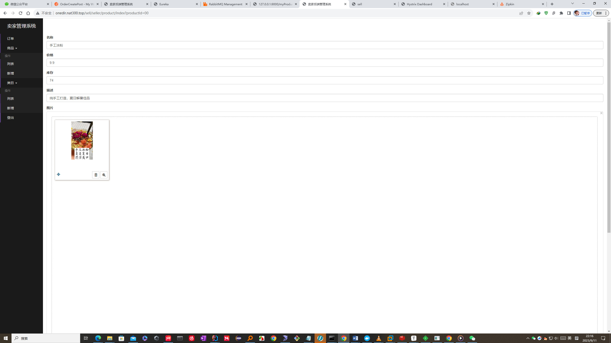
  
  - 卖家管理系统-分类列表
  
  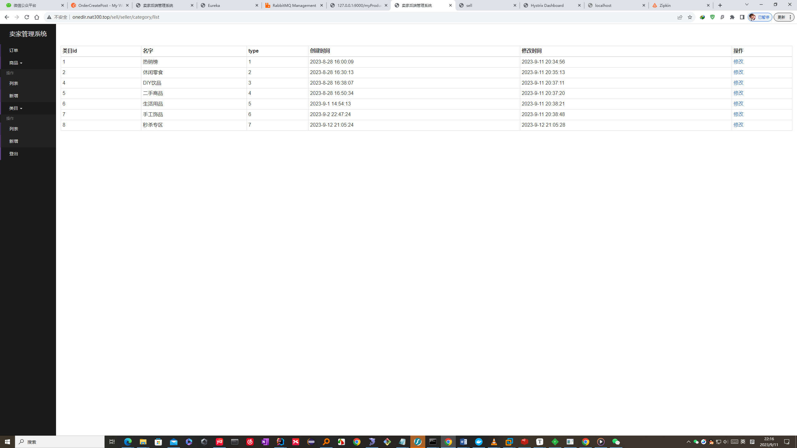
  
  - 卖家管理系统-添加分类
  
  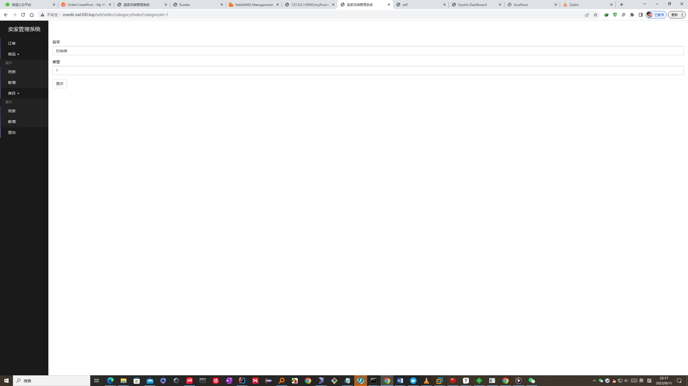
  
  - 卖家管理系统-新订单提示
  
    使用PostMan接口测试，模拟新建订单，后台管理WebSocket收到新订单，发送提示到页面上，并播放音乐。
  
  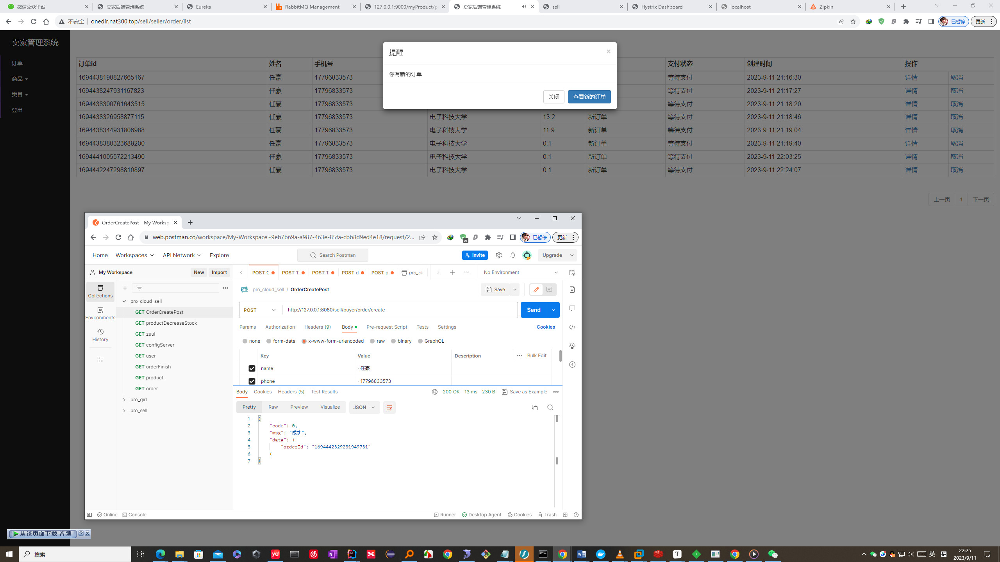

### *基于微信公众号的校园商铺平台总结一*

[Sum1](./docs/summary/Sum1.md)

### *基于微信公众号的校园商铺平台总结二*

[Sum2](./docs/summary/Sum2.md)

### *基于微信公众号的校园商铺平台总结三*

[Sum3](./docs/summary/Sum3.md)

