# *基于微信公众号的校园商铺系统总结三*

## 一、MyBatis

> **JPA与MyBatis的选择：没有好坏之分，都需要掌握，习惯哪个用哪个**

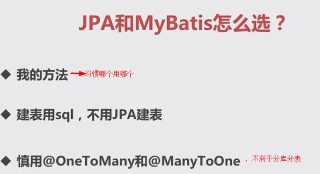

### MyBatis的使用流程

1. 引入依赖

   ```xml
   <dependency>
       <groupId>org.mybatis.spring.boot</groupId>
       <artifactId>mybatis-spring-boot-starter</artifactId>
       <version>1.3.2</version>
   </dependency>
   ```

   

2. 在入口类添加mapper包扫描的MapperScan注解

   ```java
   @SpringBootApplication
   @EnableCaching
   @MapperScan(basePackages = "com.pro.sell.dataobject.mapper")
   public class SellApplication {
   
       public static void main(String[] args) {
           SpringApplication.run(SellApplication.class, args);
       }
   
   }
   ```

   

3. 编写Mapper接口

   新建mapper包，在其中创建mapper接口

   ```java
   /**
    * 使用mybatis进行增删改查
    */
   public interface ProductCategoryMapper {
   
       @Insert("insert into product_category(category_name, category_type) values (#{categoryName, jdbcType=VARCHAR}, #{category_type, jdbcType=INTEGER})")
       int insertByMap(Map<String, Object> map);
   }
   ```

   

4. 在Service层使用mapper

   在Service层调用dao层的mapper接口方法

   ```java
   public class ProductCategoryDao {
   
       @Autowired
       ProductCategoryMapper mapper;
   
       public int insertByMap(Map<String, Object> map) {
           return mapper.insertByMap(map);
       }
   }
   ```

   

5. 配置显示mybaits的sql语句

   在application.yml中做如下配置即可

   ```yaml
   logging:
     level:
       com.pro.sell.dataobject.mapper: trace
   ```

   

### MyBatis的两种使用方式

#### 使用注解的方式注入sql语句，完成增删改查功能

1. 增（两种方式：通过map插入、通过对象插入）

   1. 在创建的mapper接口中编写insert方法

      ```java
      @Insert("insert into product_category(category_name, category_type) values (#{categoryName, jdbcType=VARCHAR}, #{category_type, jdbcType=INTEGER})")
      int insertByMap(Map<String, Object> map);
      
      @Insert("insert into product_category(category_name, category_type) values (#{categoryName, jdbcType=VARCHAR}, #{categoryType, jdbcType=INTEGER})")
      int insertByObject(ProductCategory productCategory);
      
      ```

      

   2. 单元测试

      ```java
      @Test
      public void insertByMap() {
          Map<String, Object> map = new HashMap<>();
          map.put("categoryName", "测试种类1");
          map.put("category_type", 100);
          int result = mapper.insertByMap(map);
          Assert.assertEquals(1, result);
      }
      
      @Test
      public void insertByObject() {
          ProductCategory productCategory = new ProductCategory();
          productCategory.setCategoryName("测试种类2");
          productCategory.setCategoryType(101);
          int result = mapper.insertByObject(productCategory);
          Assert.assertEquals(1, result);
      }
      ```

      

2. 删

   1. 在创建的mapper接口中编写delete方法

      ```java
      @Delete("delete from product_category where category_type = #{categoryType}")
      int deleteByCategoryType(Integer categoryType);
      ```

      

   2. 单元测试

      ```java
      @Test
      public void deleteByCategoryType() {
          int result = mapper.deleteByCategoryType(103);
          Assert.assertEquals(1, result);
      }
      ```

      

3. 改（两种方式：通过字段更新、通过对象更新）

   1. 在创建的mapper接口中编写update方法

      ```java
      @Update("update product_category set category_name = #{categoryName} where category_type = #{categoryType}")
      int updateByCategoryType(@Param("categoryName") String categoryName,
                               @Param("categoryType") Integer categoryType);
      
      @Update("update product_category set category_name = #{categoryName} where category_type = #{categoryType}")
      int updateByObject(ProductCategory productCategory);
      ```

      

   2. 单元测试

      ```java
      @Test
      public void updateByCategoryType() {
          int result = mapper.updateByCategoryType("测试种类1", 103);
          Assert.assertEquals(1, result);
      }
      
      @Test
      public void updateByObject() {
          ProductCategory productCategory = new ProductCategory();
          productCategory.setCategoryName("测试种类1");
          productCategory.setCategoryType(103);
          int result = mapper.updateByObject(productCategory);
          Assert.assertEquals(1, result);
      }
      ```

      

4. 查

   1. 在创建的mapper接口中编写select方法

      ```java
      @Select("select * from product_category where category_type = #{categoryType}")
      @Results({
          @Result(column = "category_id", property = "categoryId"),
          @Result(column = "category_name", property = "categoryName"),
          @Result(column = "category_type", property = "categoryType")
      })
      ProductCategory findByCategoryType(Integer categoryType);
      
      @Select("select * from product_category where category_name = #{categoryName}")
      @Results({
          @Result(column = "category_id", property = "categoryId"),
          @Result(column = "category_name", property = "categoryName"),
          @Result(column = "category_type", property = "categoryType")
      })
      List<ProductCategory> findByCategoryName(String categoryName);
      ```

      

   2. 单元测试

      ```java
      @Test
      public void findByCategoryType() {
          ProductCategory result = mapper.findByCategoryType(100);
          Assert.assertNotNull(result);
      }
      
      @Test
      public void findByCategoryName() {
          List<ProductCategory> result = mapper.findByCategoryName("测试种类1");
          Assert.assertNotEquals(0, result.size());
      }
      ```

      

   #### 使用xml的方式注入sql语句

   1. 在mapper接口中声明方法

      ```java
      ProductCategory selectByCategoryType(Integer categoryType);
      ```

      

   2. 在resources下创建mapper文件夹，在其中新建mapper接口对应的xml文件

      ```xml
      <?xml version="1.0" encoding="UTF-8" ?>
      <!DOCTYPE mapper PUBLIC "-//mybatis.org//DTD Mapper 3.0//EN" "http://mybatis.org/dtd/mybatis-3-mapper.dtd" >
      <mapper namespace="com.pro.sell.dataobject.mapper.ProductCategoryMapper" >
      
          <resultMap id="BaseResultMap" type="com.pro.sell.dataobject.ProductCategory">
              <id column="category_id" property="categoryId" jdbcType="INTEGER" />
              <id column="category_name" property="categoryName" jdbcType="VARCHAR" />
              <id column="category_type" property="categoryType" jdbcType="INTEGER" />
          </resultMap>
      
          <select id="selectByCategoryType" resultMap="BaseResultMap" parameterType="java.lang.Integer">
              select category_id, category_name, category_type
              from product_category
              where category_type = #{category_type, jdbcType=INTEGER}
          </select>
      </mapper>
      ```

      

   3. 在配置文件中配置xml的路径

      ```yaml
      mybatis:
        mapper-locations: classpath:mapper/*.xml
      ```

      

   4. 在入口类添加mapper包扫描

      ```java
      @SpringBootApplication
      @EnableCaching
      @MapperScan(basePackages = "com.pro.sell.dataobject.mapper")
      public class SellApplication {
      
          public static void main(String[] args) {
              SpringApplication.run(SellApplication.class, args);
          }
      
      }
      ```

      

   5. 单元测试

      ```java
      @Test
      public void selectByCategoryType() {
          ProductCategory productCategory = mapper.selectByCategoryType(103);
          Assert.assertNotNull(productCategory);
      }
      ```

      

## 二、部署SpringBoot项目的两种方式

### WAR包部署

> **修改pom文件中的打包方式为war后(默认为jar)重新打包，将war复制到tomcat下即可访问**

### JAR包部署

1. 打包

   ```shell
   # 跳过单元测试进行打包
   mvn clean package -Dmaven.test.skip=true
   ```

   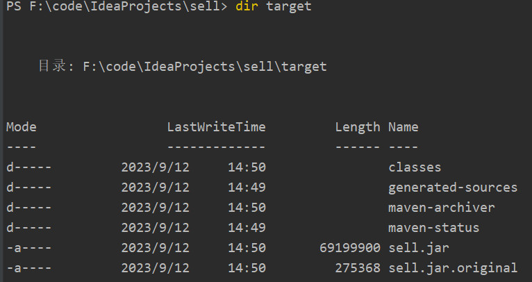

   ```xml
   <!-- 指定jar包的名称 -->
   <build>
       <finalName>sell</finalName>
       <plugins>
           <plugin>
               <groupId>org.springframework.boot</groupId>
               <artifactId>spring-boot-maven-plugin</artifactId>
               <configuration>
                   <excludes>
                       <exclude>
                           <groupId>org.projectlombok</groupId>
                           <artifactId>lombok</artifactId>
                       </exclude>
                   </excludes>
               </configuration>
           </plugin>
       </plugins>
   </build>
   ```

   

2. 上传jar包到服务器

3. 启动项目

   ```shell
   java -jar sell.jar
   ```

   

4. 指定端口启动项目

   ```shell
   java -jar -Dserver.port=8090 sell.jar
   ```

   

5. 不同环境下切换yml配置文件

   默认使用application-dev的yml文件

   ```yaml
   spring:
     profiles:
       active: dev
   ```

   启动项目时执行如下命令切换为application-prod的yml配置文件

   ```shell
   java -jar -Dserver.port=8090 -Dspring.profiles.active=prod sell.jar
   ```

   

6. 后台启动项目

   ```shell
   nohup java -jar sell.jar > /dev/null 2>&1 &
   ```

   

7. CentOS7下推荐使用Service启动项目

   a. 创建service文件

   b. 启动项目与开机自启动

## 三、Redis实现分布式锁

1. 分布式锁的应用场景：高并发、大流量应用
2. **Redis实现分布式锁的关键：Redis是单线程的**
3. Redis分布式锁支持分布式、可以更细粒度的控制、支持10万并发
4. 分布式锁的作用：多台机器上多个进程对**同一个数据**进行操作的**互斥**

### 用压测模拟高并发

使用简易工具Apache ab模拟高并发，命令如下：

```shell
>ab -n 100 -c 100 http://www.baidu.com
# -n 100 ：表示发出100个请求
# -c 100：表示模拟100个并发
# 整个命令的含义：表示100个人同时访问这个url

>ab -t 60 -c 100 http://www.baidu.com
# 整个命令的含义：表示60秒内100个人同时访问这个url
```

### 高并发情况下程序出现的问题

1. 应用架构

   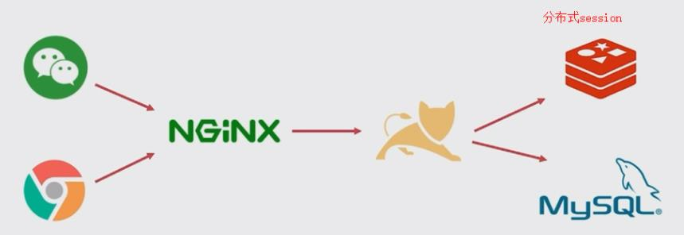

2. 简易模拟秒杀程序

   ```java
   /**
    * 秒杀功能
    */
   @RestController
   @RequestMapping("/skill")
   @Slf4j
   public class SecKillController {
   
       @Autowired
       private SecKillService secKillService;
   
       /**
        * 查询秒杀活动特价商品的信息
        * @param productId
        * @return
        */
       @GetMapping("/query/{productId}")
       public String query(@PathVariable String productId) throws Exception {
           return secKillService.querySecKillProductInfo(productId);
       }
   
   
       /**
        * 秒杀，没有抢到获得"网络开小差了,xxxxx",抢到了会返回剩余的库存量
        * @param productId
        * @return
        * @throws Exception
        */
       @GetMapping("/order/{productId}")
       public String skill(@PathVariable String productId)throws Exception {
           log.info("@skill request, productId:" + productId);
           secKillService.orderProductMockDiffUser(productId);
           return secKillService.querySecKillProductInfo(productId);
       }
   }
   ```

   

3. 秒杀程序在非高并发情况下执行秒杀的正常执行结果

   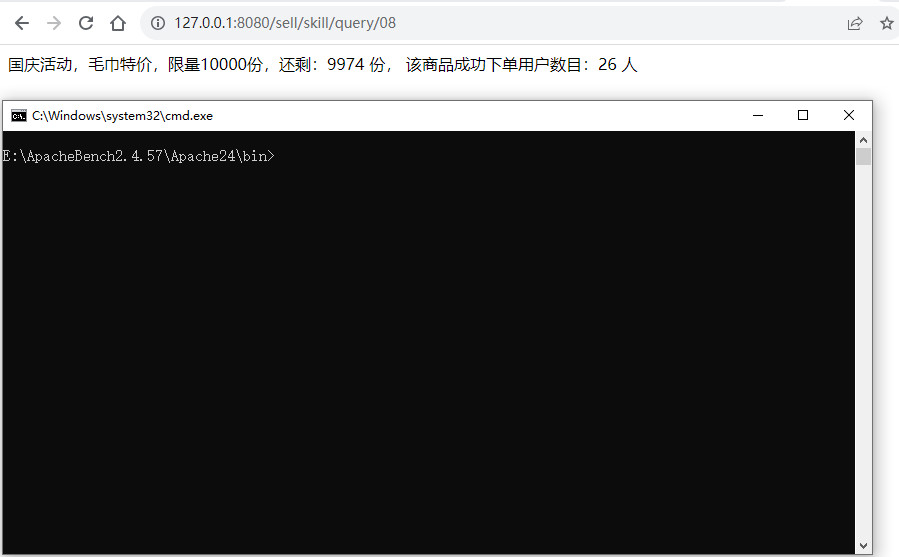

4. 秒杀程序通过压测模拟高并发情况下执行秒杀，出现“超卖”结果

   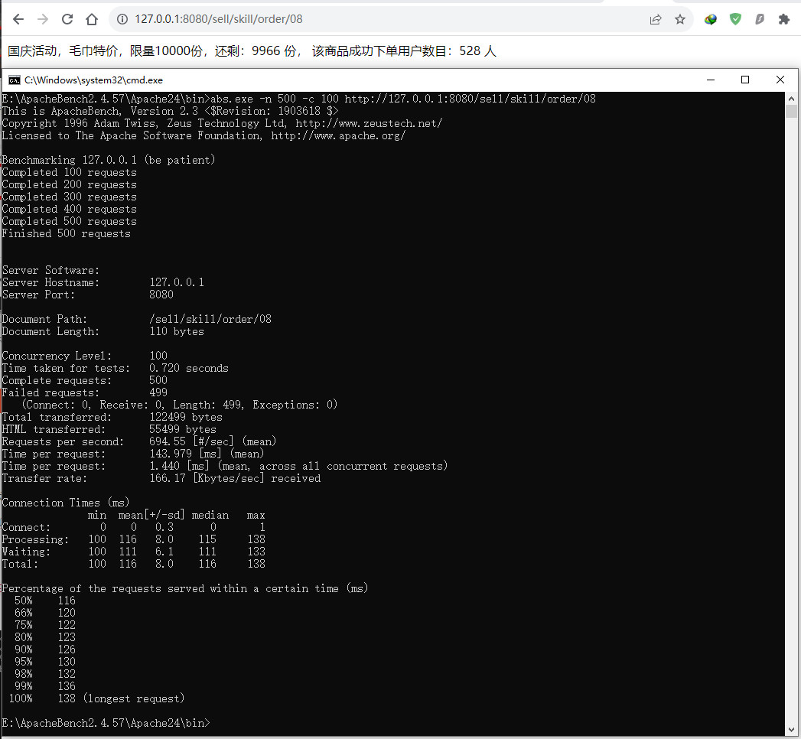

5. 分析代码，看“超卖”出现的原因

   ```java
   @Override
   public void orderProductMockDiffUser(String productId) {
       //1.查询该商品库存，为0则活动结束。
       int stockNum = stock.get(productId);
       if(stockNum == 0) {
           throw new SellException(100,"活动结束");
       }else {
           //2.下单(模拟不同用户openid不同)
           orders.put(KeyUtil.genUniqueKey(),productId);
           //3.减库存
           stockNum =stockNum-1;
           try {
               Thread.sleep(100);
           } catch (InterruptedException e) {
               e.printStackTrace();
           }
           stock.put(productId,stockNum);
       }
   }
   /**
   分析超卖原因：
       在sleep的时候，大量用户同时访问和修改同一个变量，比如在项目中，大量用户在同时减库存stockNum，可能存在上一个用户减库存后，新库存还没有保存至数据库，下一个用户就会在旧库存的基础上进行购买，这样就会导致超卖现象；
       注意：sleep模拟的是操作数据库的过程，实际中也会有这个延迟；
   */
   ```

   

### 解决方案一：使用synchronized解决高并发

> 缺点：执行该方法变慢；无法做到细粒度控制（因为加到方法上，所以对秒杀所有商品都很慢）；只适合单点的情况

在方法上加 synchronized 关键字，保证方法以单线程方式执行，解决超卖问题

```java
//可以使用synchronized关键字对方法进行修饰，从而解决高并发情况下超卖的问题；
//缺点：访问速度慢；无法细粒度的处理；
@Override
public synchronized void orderProductMockDiffUser(String productId) {
    //1.查询该商品库存，为0则活动结束。
    int stockNum = stock.get(productId);
    if(stockNum == 0) {
        throw new SellException(100,"活动结束");
    }else {
        //2.下单(模拟不同用户openid不同)
        orders.put(KeyUtil.genUniqueKey(),productId);
        //3.减库存
        stockNum =stockNum-1;
        try {
            Thread.sleep(100);
        } catch (InterruptedException e) {
            e.printStackTrace();
        }
        stock.put(productId,stockNum);
    }
}
```

### 解放方案二：使用Redis分布式锁解决高并发

> Redis分布式锁使用到的关键命令：
>
> setnx: 加锁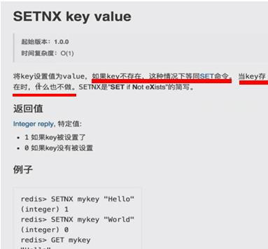
>
> getset:先get再set
>
> 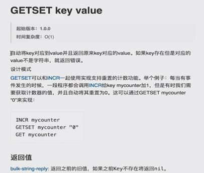
>
> 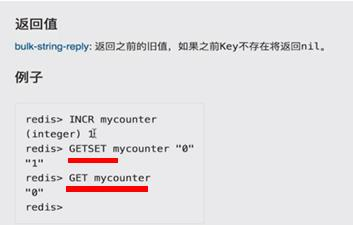


1. redis加锁与解锁功能实现

   ```java
   /**
    * Redis实现分布式锁：
    * 使用Redis对一段代码进行加锁，解决高并发情况下超卖的问题；
    * 特点：
    * 支持分布式；
    * 可以更细粒度的控制；
    * 多台机器上多个进程对一个数据进行操作的互斥；
    */
   @Component
   @Slf4j
   public class RedisLock {
   
       @Autowired
       private StringRedisTemplate redisTemplate;
   
       /**
        * 加锁
        * @param key
        * @param value 当前时间+超时时间
        * @return
        */
       //死锁：如果第一个线程拿到锁，由于执行出错，导致未能释放锁，则其它线程由于锁未被释放所以一直拿不到锁，这种现象称为死锁；
       public boolean lock(String key, String value) {
           //如果当前线程拿到锁，则直接返回true
           //如果key不存在则保存后返回true，说明获得锁；
           if(redisTemplate.opsForValue().setIfAbsent(key, value)) {
               return true;
           }
           //如果当前线程没有拿到锁，判断拿到锁的线程有没有过期
           //currentValue=A   这两个线程的value都是B  其中一个线程拿到锁
           String currentValue = redisTemplate.opsForValue().get(key);
           //如果锁过期
           if (!StringUtils.isEmpty(currentValue)
                   && Long.parseLong(currentValue) < System.currentTimeMillis()) {
               //如果第一个线程拿到锁后，由于出现异常并未释放锁，并且锁已过期，则其它线程依旧可以拿到锁，不会造成死锁现象
               //获取上一个锁的时间
               String oldValue = redisTemplate.opsForValue().getAndSet(key, value);
               if (!StringUtils.isEmpty(oldValue) && oldValue.equals(currentValue)) {
                   return true; //第二个线程拿到新锁
               }
           }
           //如果锁未过期，则其它线程无法拿到锁，无法修改库存
           return false;
       }
   
       /**
        * 解锁
        * @param key
        * @param value
        */
       public void unlock(String key, String value) {
           try {
               String currentValue = redisTemplate.opsForValue().get(key);
               if (!StringUtils.isEmpty(currentValue) && currentValue.equals(value)) {
                   redisTemplate.opsForValue().getOperations().delete(key);
               }
           }catch (Exception e) {
               log.error("【redis分布式锁】解锁异常, {}", e);
           }
       }
   
   }
   ```

   

2. 通过redis分布式锁实现高并发

   ```java
   //redis分布式锁实现高并发
   @Override
   public void orderProductMockDiffUser(String productId) {
       //加锁
       long time = System.currentTimeMillis() + TIMEOUT;
       if(!redisLock.lock(productId, String.valueOf(time))){
           throw new SellException(101, "网络开小差了，换个姿势再试试~~");
       }
   
       //1.查询该商品库存，为0则活动结束。
       int stockNum = stock.get(productId);
       if(stockNum == 0) {
           throw new SellException(100,"活动结束");
       }else {
           //2.下单(模拟不同用户openid不同)
           orders.put(KeyUtil.genUniqueKey(),productId);
           //3.减库存
           stockNum =stockNum-1;
           try {
               Thread.sleep(100);
           } catch (InterruptedException e) {
               e.printStackTrace();
           }
           stock.put(productId,stockNum);
       }
   
       //解锁
       redisLock.unlock(productId, String.valueOf(time));
   }
   ```

   

3. 测试

   添加redis分布式锁后，由于锁的存在，使用ab模拟发送500个请求，只有10人下单成功

   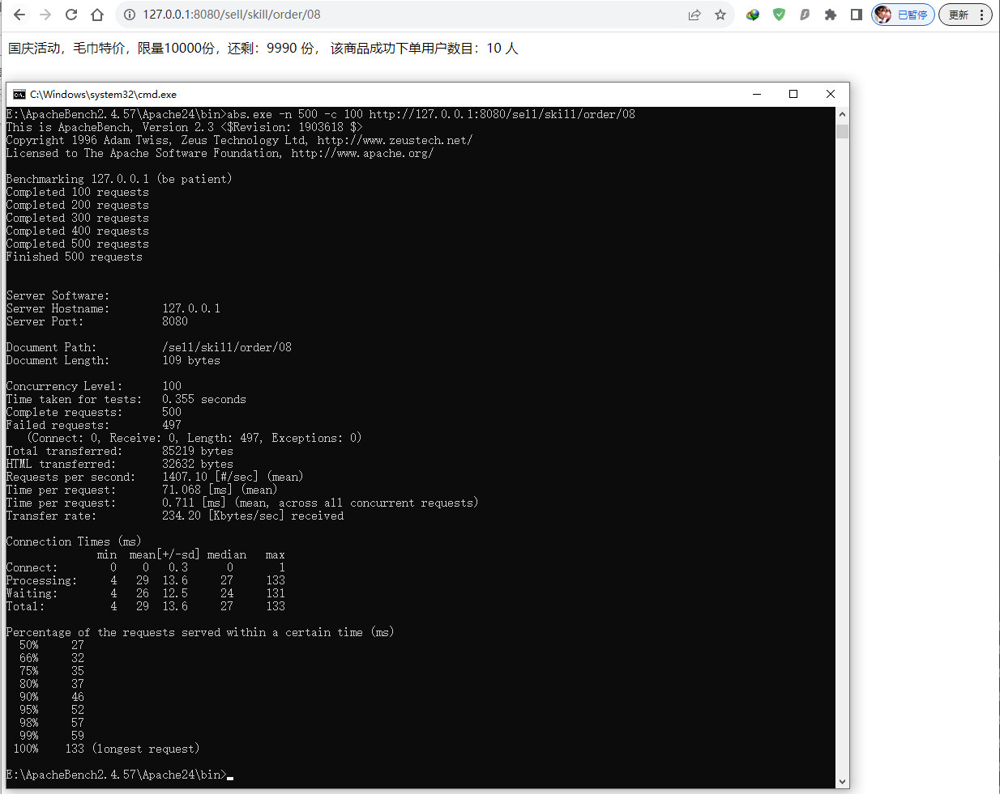

## 四、Redis实现数据缓存层

> 数据缓存层的作用：仅第一次执行方法访问数据库，之后都是访问Redis读取数据，提高读取数据的速度

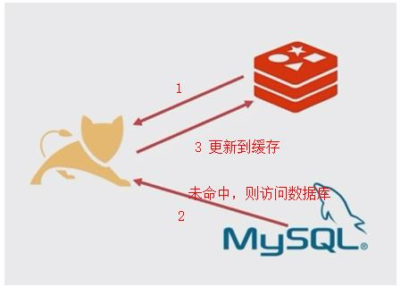

1. 数据缓存层的应用场景：大流量场景
2. 数据缓存层的作用：提高数据读取速度
3. **注意：需要保存到Redis中的对象都需要序列化**
4. 数据缓存主要通过三个注解实现：@Cacheable()、@CacheEvict、@CachePut
5. 需要结合业务场景，避免滥用
6. 数据缓存层的主要概念：命中、失效、更新

### 通过注解实现Redis数据缓存层的步骤

1. 在入口类加@EnableCacheing注解，启动缓存

   ```java
   @SpringBootApplication
   @EnableCaching
   @MapperScan(basePackages = "com.pro.sell.dataobject.mapper")
   public class SellApplication {
   
       public static void main(String[] args) {
           SpringApplication.run(SellApplication.class, args);
       }
   
   }
   ```

   

2. 在Controller的方法加上@Cacheable()注解,使用缓存

   ```java
   /**
        * 买家端查看上架商品列表
        * @Cacheable: 缓存层的注解：
        *          参数： cacheNames表示redis的key的目录
        *                key表示实际的redis中的key，如不写，默认取
        *                只有cacheNames与key都相同，才能说明是同一条redis的数据
        *          作用： 第一次执行方法访问数据库并将数据保存到redis中，
        *                并通过参数的cacheNames和key唯一标识这条数据
        *                之后都是访问Redis读取数据，提高读取数据的速度
        * @param sellerId
        * @return
        */
   @GetMapping("/list")
   @Cacheable(cacheNames = "product",key = "123")
   public ResultVO list(@RequestParam(value = "sellerId", required = false) String sellerId){
       //1.查询所有的上架商品
       List<ProductInfo> productInfoList = productService.findUpAll();
       //2.查询所有上架商品的类目(一次性查询)
       //        ArrayList<Integer> categoryTypeList = new ArrayList<>();
       //        //传统方法
       //        for(ProductInfo productInfo : productInfoList){
       //            categoryTypeList.add(productInfo.getCategoryType());
       //        }
       //lamdba表达式
       List<Integer> categoryTypeList = productInfoList.stream()
           .map(e -> e.getCategoryType())
           .collect(Collectors.toList());
       List<ProductCategory> productCategoryList = categoryService.findByCategoryTypeIn(categoryTypeList);
       //3.数据拼装(拼装成ResultVO返回到前端)
       List<ProductVO> productVOList = new ArrayList<>();
       for(ProductCategory productCategory : productCategoryList){
           //根据productCategory拼装ProductVO
           ProductVO productVO = new ProductVO();
           productVO.setCategoryType(productCategory.getCategoryType());
           productVO.setCategoryName(productCategory.getCategoryName());
           //将ProductInfo放入productInfoVOList
           List<ProductInfoVO> productInfoVOList = new ArrayList<>();
           for(ProductInfo productInfo : productInfoList){
               if(productInfo.getCategoryType().equals(productCategory.getCategoryType())){
                   ProductInfoVO productInfoVO = new ProductInfoVO();
                   BeanUtils.copyProperties(productInfo, productInfoVO);
                   productInfoVOList.add(productInfoVO);
               }
           }
           //将productInfoVOList放入productVO
           productVO.setProductInfoVOList(productInfoVOList);
           //将productVO放入productVOList
           productVOList.add(productVO);
       }
       //根据productVOList生成ResultVO
       return ResultVOUtil.success(productVOList);
   }
   ```

   > 第一次访问该方法是执行该方法内部代码，之后就是访问的缓存，不再执行该方法内部代码，除非缓存过期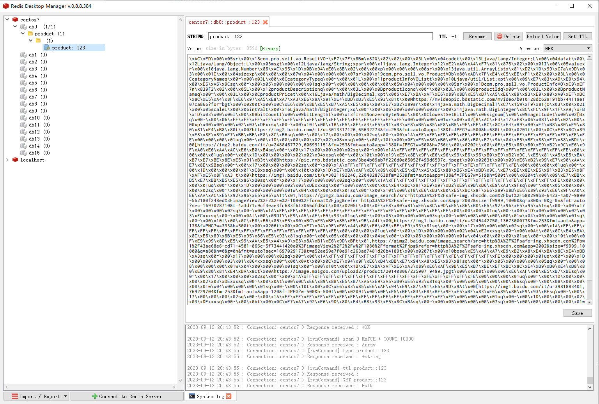

3. 序列化返回对象

   ```java
   /**
    * http请求返回的最外层对象
    */
   @Data
   //@JsonInclude(JsonInclude.Include.NON_NULL)
   public class ResultVO<T> implements Serializable {
   
       private static final long serialVersionUID = 9148921404840892546L;
   
       /** 错误码. */
       private Integer code;
   
       /** 提示信息. */
       private String msg;
   
       /** 具体内容. */
       private T data;
   }
   ```

   

4. 安装自动生成序列化id的插件，并配置快捷键

   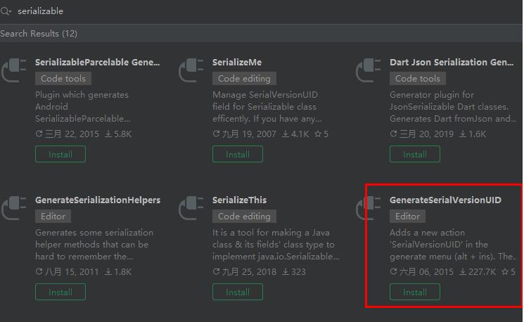

### 实现数据一致性的方式1————通过@CacheEvict注解

> **方式一：每次保存更新数据后都删除缓存中的数据————通过在保存更新方法上加@CacheEvict注解实现**
>
> **@CacheEvict注解的作用：执行完该方法之后，清除Redis中的缓存**

```java
/**
     * 保存/更新商品信息
     * @CachePut: 每次都会执行此方法，但每次执行完该方法后都会将最新的结果保存到redis中
     * @CacheEvict：执行完此方法后，清除redis中的缓存
     * @param form
     * @param bindingResult
     * @param map
     * @return
     */
@PostMapping("/save")
@CacheEvict(cacheNames = "product", allEntries = true, beforeInvocation = true)
public ModelAndView save(@Valid ProductForm form,
                         BindingResult bindingResult,
                         Map<String, Object> map) {
    if (bindingResult.hasErrors()) {
        map.put("msg", bindingResult.getFieldError().getDefaultMessage());
        map.put("url", "/sell/seller/product/index");
        return new ModelAndView("common/error", map);
    }

    ProductInfo productInfo = new ProductInfo();
    try {
        //如果productId为空, 说明是新增
        if (!StringUtils.isEmpty(form.getProductId())) {
            productInfo = productService.findOne(form.getProductId());
        } else {
            form.setProductId(KeyUtil.genUniqueKey());
        }
        BeanUtils.copyProperties(form, productInfo);
        productService.save(productInfo);
    } catch (SellException e) {
        map.put("msg", e.getMessage());
        map.put("url", "/sell/seller/product/index");
        return new ModelAndView("common/error", map);
    }

    map.put("url", "/sell/seller/product/list");
    return new ModelAndView("common/success", map);
}
```

### 实现数据一致性的方式二————通过@CachePut注解

> **方式二：每次修改数据后都实时更新到Redis缓存中——通过在保存更新方法上加@CachePut注解实现**
> **@CachePut注解的作用：每次都会执行该方法，但每次执行完该方法后都会将最新的结果保存到Redis中，这样查询方法可以直接从Redis中查询，不再访问数据库**

```java
/**
     * 保存/更新商品信息
     * @CachePut: 每次都会执行此方法，但每次执行完该方法后都会将最新的结果保存到redis中
     * @CacheEvict：执行完此方法后，清除redis中的缓存
     * @param form
     * @param bindingResult
     * @param map
     * @return
     */
@PostMapping("/save")
@CachePut(cacheNames = "product", key = "123")
public ModelAndView save(@Valid ProductForm form,
                         BindingResult bindingResult,
                         Map<String, Object> map) {
    if (bindingResult.hasErrors()) {
        map.put("msg", bindingResult.getFieldError().getDefaultMessage());
        map.put("url", "/sell/seller/product/index");
        return new ModelAndView("common/error", map);
    }

    ProductInfo productInfo = new ProductInfo();
    try {
        //如果productId为空, 说明是新增
        if (!StringUtils.isEmpty(form.getProductId())) {
            productInfo = productService.findOne(form.getProductId());
        } else {
            form.setProductId(KeyUtil.genUniqueKey());
        }
        BeanUtils.copyProperties(form, productInfo);
        productService.save(productInfo);
    } catch (SellException e) {
        map.put("msg", e.getMessage());
        map.put("url", "/sell/seller/product/index");
        return new ModelAndView("common/error", map);
    }

    map.put("url", "/sell/seller/product/list");
    return new ModelAndView("common/success", map);
}
```

### 缓存层的注意事项

1. 使用@CachePut注解时，返回的数据格式必须与查询方法的返回格式一致

   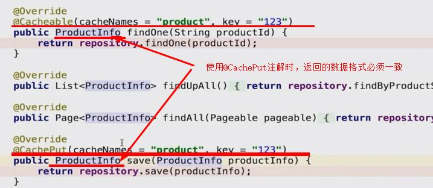

2. 缓存层：需要适度使用，防止过度使用

3. @Cacheable()、@CacheEvict、@CachePut三个注解中的key必须填写为非空的字符串，这个值将作为redis中的key。如果不填写，则取方法的参数的值作为这个key的值

4. @Cacheable()、@CacheEvict、@CachePut三个注解中的cacheNames的值，可以统一在类上使用@CacheConfig()来声明

   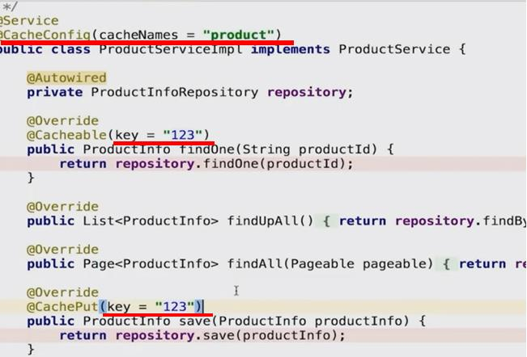

5. @Cacheable()、@CacheEvict、@CachePut三个注解中key可以动态赋值

   

6. @Cacheable()、@CacheEvict、@CachePut三个注解中可以加condition属性，当condition的值成立时才缓存

   

7. @Cacheable()、@CacheEvict、@CachePut三个注解中可以加unless属性，当返回的对象满足一定条件时才缓存

   